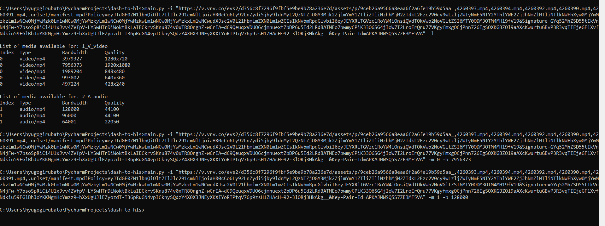

# DashToHLS [](https://github.com/hyugogirubato/dash2hls/releases)

You can now convert all of your dash files to HLS format so that you can use them more easily.

## Features
* Download a dash file in text format
* Convert a dash file to JSON format
* Convert dash file to HLS file
* Convert dash file to source url list

## Download Anime Downloader [Windows]
> Note : Currently only windows executable is provided (Linux, Mac users go to [Build from source](#Building-from-source))

Download the [Latest Release](https://github.com/hyugogirubato/dash2hls/releases) from here and extract the zip file

#### A conversion error? Go ahead and post your issue [here](https://github.com/hyugogirubato/dash2hls/issues). And I will look into the error and give necessary fixes!

## Running the application
Navigate to the extracted folder and open a cmd or powershell window from that folder and execute "dash2hls.exe" from command line.

If you're running from source files, execute the "main.py" script

```bash
python3 ./main.py
```

## How to convert using dash2hls (CLI)?

First, you need to familiarize yourself with the commands you can use the dash to HLS converter.

```
Commands List :
  -h, --help            Show this help message and exit.
  -i, --input           Manifest file url.
      --headers         Using a custom header.
  -l, --list            List of available media.
  -m, --media           Index of selected media.
  -b, --bandwidth       Choice of quality among the selected media.
  -p, --path            Custom save path of HLS file.
  -o, --output          Output file name (without extension).
```
Above mentioned are the arguments you need to use to convert dash source to HLS.

# Implementation
You can also directly use dash 2 hls directly as a library to integrate it into a program and directly retrieve the desired information.
```python
import dash2hls

url = 'URL'
media_video = 0
media_audio = 1
bandwidth_video = 0
bandwidth_audio = 0

mdp = dash2hls.Converter(url)
print(mdp.json_manifest)

# Video
selected = [mdp.json_manifest[media_video], bandwidth_video]
mdp.save_hls(selected[0], selected[1])
print(mdp.get_url_list(selected[0], selected[1]))

# Audio
selected = [mdp.json_manifest[media_audio], bandwidth_audio]
mdp.save_hls(selected[0], selected[1])
print(mdp.get_url_list(selected[0], selected[1]))
```

## Building from source

- Clone the project using to your local machine

### Prerequisites

- Make sure python 3.7+ (preferably the latest version) and pip3 is installed

### Installing

1) Download the dependancies using requirements.txt file

```
pip install -r requirements.txt 
```

## Usage

To see the full available commands, run

```bash
python ./main.py --help
```

```
usage: main.py [-h] [--input INPUT] [--headers HEADERS] [--list] [--media MEDIA] [--bandwidth BANDWIDTH] [--path PATH]
               [--output OUTPUT]

dash2hls Command Line Tool

optional arguments:
  -h, --help            Show this help message and exit.
  -i, --input           Manifest file url.
      --headers         Using a custom header.
  -l, --list            List of available media.
  -m, --media           Index of selected media.
  -b, --bandwidth       Choice of quality among the selected media.
  -p, --path            Custom save path of HLS file.
  -o, --output          Output file name (without extension).
```
## Examples
Display the list of media available for a dash file
```bash
python3 ./main.py --input "URL" --list
```
Convert dash file based on selection
```bash
python3 ./main.py --input "URL" --media INDEX --bandwidth BANDWIDTH
```


## Authors

* **hyugogirubato** - *Author* - [hyugogirubato](https://github.com/hyugogirubato)

## License

This project is licensed under the MIT License - see the [LICENSE.md](LICENSE.md) file for details

## Disclaimer
This software has been developed only for educational purposes by the [Author](https://github.com/hyugogirubato). By no means this encourage content piracy. Please support original content creators!
